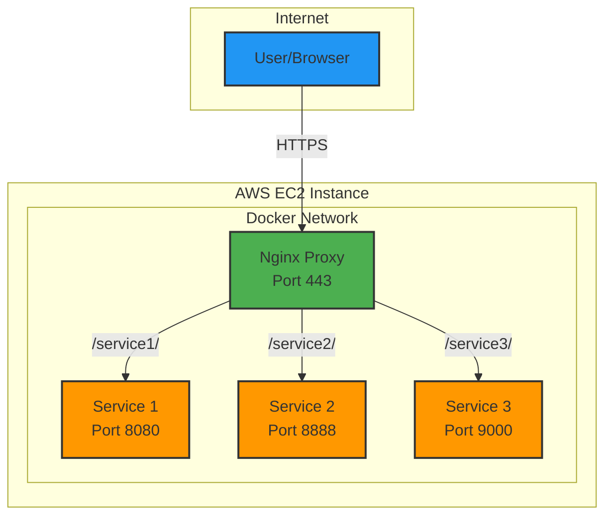

# nginx-multi-service-proxy-for-testing
A simple nginx reverse proxy setup for testing multiple services behind a single HTTPS endpoint. FOR TESTING ONLY - No security layers included.

# ⚠️ NEVER USE IN PRODUCTION ⚠️

# Description
This repository provides a Docker-based nginx reverse proxy configuration that allows you to expose multiple services through a single HTTPS endpoint with path-based routing. Originally designed for testing Spark clusters and Jupyter notebooks in AWS environments.

### Perfect for:
* Development and testing environments
* AWS EC2 instances for temporary testing
* Multi-service application testing
* Learning reverse proxy concepts

# Architecture



# Configuration
.env file example
```batch
# Nginx Configuration
APP_PORT=8888
APP_SERVICE_NAME=jupyter-spark
NETWORK_NAME=spark-jupyter-scala_spark-net

# Number of services to proxy
SERVICE_COUNT=2

# Service 1
SERVICE_1_PATH=/jupyter
SERVICE_1_NAME=jupyter-spark
SERVICE_1_PORT=8888

# Service 2  
SERVICE_2_PATH=/spark
SERVICE_2_NAME=spark-master
SERVICE_2_PORT=8080
```

#### Each service needs:
* *PATH*: URL path (e.g., /jupyter)
* *NAME*: Docker service name
* *PORT*: Internal port number


# How It Works
* Template Processing: create_config.py reads .env and generates nginx.conf
* SSL Generation: Self-signed certificates for HTTPS testing
* Path Routing: Nginx routes based on URL paths (/service1/, /service2/)
* URL Rewriting: sub_filter fixes internal URLs to include proxy paths
* Service Proxy: Routes requests to appropriate Docker services
